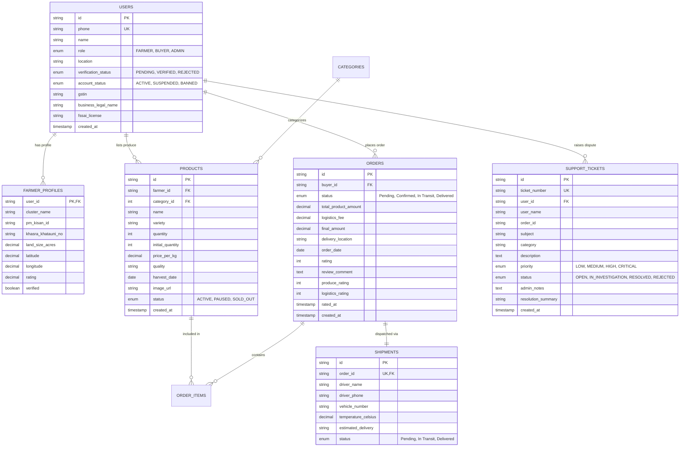

# FarmDirect: Direct Farm-to-Consumer & B2B Cold-Chain Disintermediation Platform

> **Smart India Hackathon (SIH 2026)**  
> **Problem Statement ID**: `SIH26033`  
> **Problem Statement Title**: *Multiple intermediaries reduce farmers' earnings and increase consumer prices*  
> **Team Name**: *AGRONEX AI*  
> **Live Web Application**: [http://169.58.5.209:3000](http://169.58.5.209:3000)  
> **Android Mobile App (APK)**: [http://169.58.5.209:3000/downloads/farmdirect-latest.apk](http://169.58.5.209:3000/downloads/farmdirect-latest.apk)  
> **Target Repository**: `git@github.com:Shivam07030/FarmDirect-SIH-2026.git` (`dev` branch)

---

## 1. Executive Summary

In India's traditional agricultural supply chain, produce passes through 4 to 7 layers of intermediaries—village aggregators, commission agents (*arhatiyas*), APMC mandi traders, secondary wholesalers, and urban retailers. By the time fresh produce reaches the end consumer, **farmers receive only 28% to 35% of the consumer rupee**, while consumers face inflated prices and artificial shortages. Furthermore, due to the lack of an integrated cold chain, **post-harvest losses for perishables exceed 20% to 25%** during transit.

**FarmDirect** is an end-to-end digital agricultural marketplace and telematics logistics platform that eliminates unnecessary intermediaries. It connects verified smallholder farmers directly to household consumers and institutional bulk buyers via a refrigerated cold-chain corridor. 

By integrating **Algorithmic Fair Price Collars**, **Dual-Tier Anti-Hoarding Rationing**, **IoT Reefer Telematics**, **Digital Escrow Handover**, and an **Industry-Grade Grievance & Dispute Desk**, FarmDirect increases farmer net income by **+33% to +45%**, reduces consumer grocery bills by **15% to 22%**, and cuts post-harvest spoilage to **under 4%**.

---

## 2. Problem Statement & Deep Analysis

### The Root Problem: The "Lost Rupee" Supply Chain
When a consumer in Delhi NCR pays **₹35 per kg** for tomatoes:
* The farmer in Agra/Mathura receives only **₹18/kg** (51% gross, often <35% net after mandi cuts).
* Village Aggregator takes: **₹2.50/kg**
* Mandi Commission Agent (*Arhatiya*): **₹3.50/kg** + unloading cess
* Secondary Wholesaler markup: **₹4.00/kg**
* Urban Retailer markup: **₹7.00/kg**

### Key Vulnerabilities in Traditional Mandis:
1. **Price Asymmetry & Distress Selling**: Farmers have no real-time price discovery and are forced to sell at distressed floor rates at local APMC gates to avoid rotting produce.
2. **Transit Spoilage (No Cold-Chain)**: Perishables travel in open-air trucks under extreme heat (>38°C), causing massive dehydration and bacterial rot.
3. **Speculative Hoarding & Artificial Inflation**: Cartels corner wholesale supply, creating artificial retail shortages and high price spikes.
4. **Payment Delays**: Traditional traders delay payments to farmers by 15 to 45 days, trapping farmers in high-interest informal credit cycles.

---

## 3. The FarmDirect Solution

FarmDirect creates an open, transparent, and secure direct-procurement corridor:

```
[ Verified Farmer (Agra/Mathura Cluster) ]
                  │
                  ▼  (Verified Land & PM-KISAN KYC)
[ FarmDirect Algorithmic Fair Price Collar ] (Guarantees MSP Floor & Prevents Distress Selling)
                  │
                  ▼  (Inspected & Sealed at Farm-Gate)
[ 4°C Active Reefer Cold-Chain Transit ] (Continuous IoT Temperature & Telematics Logging)
                  │
                  ▼  (Dual-Tier Procurement Corridor)
  ┌───────────────────────────────┴───────────────────────────────┐
  ▼                                                               ▼
[ Household Consumer Section ]                 [ Institutional Wholesale Section ]
(Anti-Hoarding Max 2 kg Cap · Flat ₹25 Fee)    (Bulk Batches · 15-Digit GSTIN & FSSAI)
                  │                                               │
                  └───────────────────────┬───────────────────────┘
                                          │
                                          ▼
                      [ Amazon-Grade Live Delivery Tracker ]
                                          │
                                          ▼  (4-Digit OTP Handover)
                      [ Digital Escrow Handover & Instant Settlement ]
```

---

## 4. Key Innovation Modules

### Module 1: Farmer Empowerment & Government KYC Integration
* **PM-KISAN ID & Khasra/Khatauni Land Record Verification**: Verifies genuine cultivators and blocks commercial traders from posing as farmers.
* **Cluster Geolocation**: Automatic GPS geolocation and cluster mapping (e.g., Agra Tomato Cluster, Mathura Belt, Aligarh Region).
* **Native Camera Capture**: Mobile camera integration for photographing freshly harvested produce crates for quality grading.

### Module 2: Dynamic Algorithmic Fair Price Collar Engine
* **MSP Distress Floor**: Prevents farmers from being exploited below minimum support levels and production cost.
* **Fair Price Optimal Band**: Algorithmic pricing based on district-level mandi averages, crop perishability index, and consumer demand forecasts.
* **Speculative Ceiling**: Protects consumers against artificial cartel markups and inflation.

### Module 3: Dual-Tier Buyer Marketplace (Anti-Hoarding Architecture)
* **Tier 1 — Normal Buyer (Household Consumer)**:
  - Strict purchase limit capped at **maximum 2.0 kg per crop** (controlled dynamically from Admin).
  - Prevents hoarders and unauthorized street vendors from wiping out subsidized produce.
  - Subsidized flat ₹25 local eco-delivery.
* **Tier 2 — Wholesaler (B2B Commercial Batch)**:
  - Designed for retail supermarket chains, culinary cooperatives, and food processors.
  - Minimum order quantity (MOQ) of **25 kg to 500+ kg**.
  - Mandates verified **15-digit GSTIN** and **14-digit FSSAI license**.
  - Dynamic freight calculation based on volume and refrigerated tonnage.

### Module 4: IoT Reefer Cold-Chain Telematics & Live Tracking
* **Continuous Temperature Monitoring**: Reefer containers maintain produce at a steady **3.8°C to 4.5°C**.
* **Automatic Cold-Chain Breach Sensor Alert**: If temperature crosses **6.0°C**, an automatic breach alert is recorded in the shipment telematics log.
* **Amazon-Style Tracking Timeline**: Step-by-step progress from Farm-Gate Pickup, Regional Cross-Dock, Highway Transit, to Doorstep Arrival.
* **Secure Delivery OTP**: Handover verified via a cryptographic 4-digit OTP.

### Module 5: Dispute Resolution Desk & Grievance Redressal
* **Dispute Ticketing System**: Farmers and buyers can raise support tickets categorized into:
  - `DAMAGED_PRODUCE` (spoiled or bruised crates)
  - `COLD_CHAIN_TEMP_BREACH` (sensor logged >6.0°C)
  - `PAYMENT_ESCROW` (bank transfer settlement query)
  - `WEIGHMENT_DISCREPANCY` (crate weight difference)
  - `MIDDLEMAN_SUSPICION` (unauthorized trader masquerading as farmer)
* **Admin Resolution Console**: Market authorities review evidence, telematics logs, and can approve compensation or escrow release.

### Module 6: Produce Freshness & Logistics Rating Engine
* **Multi-Criteria Rating Modal**: Evaluates fulfilled orders on:
  - Overall satisfaction (1 to 5 stars)
  - Produce freshness and crispness (1 to 5 stars)
  - Cold-chain temperature maintenance and delivery speed (1 to 5 stars)
* **Automated Farmer Reputation Sync**: Calculates real-time average star ratings in MySQL and displays verified ratings on produce cards across the marketplace.

### Module 7: Market Authority & Administrator Console
* **Zero-Hardcoding Dynamic Market Rules**: Admin can update retail rationing caps, wholesale MOQs, and delivery rates live without restarting the server.
* **Account Sanctions Engine**: Ability to `SUSPEND` or `BAN` bad actors, automatically pausing their product listings and blocking unauthorized orders.

---

## 5. Technology Stack

| Layer | Technologies Used | Rationale & Capabilities |
| :--- | :--- | :--- |
| **Frontend Framework** | **React 19**, **TypeScript 5.8**, **Vite 6** | Modern, strictly typed, zero-runtime overhead, sub-second HMR. |
| **Styling & Design System** | **Tailwind CSS v4**, **Lucide React** | Mobile-first, fully responsive design optimized for rural farmers and enterprise desktops. |
| **Mobile Platforms** | **Capacitor 8 (Android & iOS)**, **PWA** | Native camera access, hardware GPS geolocation, offline capabilities, standalone installable APK. |
| **Backend & API Server** | **Node.js**, **Express 4**, **RESTful Architecture** | High-throughput asynchronous routing, ACID transaction locks (`FOR UPDATE`) for inventory concurrency. |
| **Database Management** | **MySQL 8.0** (InnoDB), **Connection Pool** | Fully normalized 3NF relational schema, foreign key cascade integrity, index-optimized order querying. |
| **Database Administration**| **phpMyAdmin** (Nginx Reverse Proxy) | Web-based database administration, live inspection of tables during hackathon vivas. |
| **State Management** | **React Context API**, **HTML5 LocalStorage Sync** | Optimistic UI updates with instant local feedback and background server synchronization. |
| **Charts & Analytics** | **Recharts 3** | Interactive mandi vs. FarmDirect price comparison curves and 7-day predictive demand charts. |
| **Production Server** | **Ubuntu Linux Cloud Server (`169.58.5.209`)** | **PM2 Process Manager**, **Systemd Services**, **Automated CI/CD Shell Deployment Script** (`/root/deploy.sh`). |

---

## 6. Complete Database Schema (3NF Architecture)



---

## 7. Socio-Economic Impact & Quantifiable ROI

| Metric | Traditional APMC Middleman Model | FarmDirect Disintermediation Platform | Net Benefit |
| :--- | :--- | :--- | :--- |
| **Farmer Share of Consumer Rupee** | 28% – 35% | **68% – 75%** | **+35% to +45% higher farmer net revenue** |
| **Consumer Retail Price** | ₹35 – ₹40 / kg | **₹27 – ₹30 / kg** | **18% – 25% lower household food cost** |
| **Post-Harvest Cold-Chain Losses** | 20% – 25% (open heat transit) | **< 4%** (monitored 4°C reefer) | **> 80% reduction in food spoilage** |
| **Payment Realization Window** | 15 – 45 Days (credit slips) | **Instant** (upon OTP delivery scan) | **Zero debt & working capital liquidity** |
| **Quality & Origin Traceability** | 0% (unlabeled mandi lots) | **100%** (PM-KISAN geotagged origin) | **Consumer food safety guarantee** |

---

## 8. Alignment with Government of India Initiatives

1. **PM-KISAN (Pradhan Mantri Kisan Samman Nidhi)**: Integrated KYC authentication verifying land records and smallholder status.
2. **e-NAM (National Agriculture Market)**: Complements e-NAM by solving the "first-mile refrigerated logistics" barrier.
3. **Food Safety & Standards Authority of India (FSSAI)**: Mandates food safety compliance for all commercial B2B procurement.
4. **GST E-Way Bill System**: Automated commercial invoices with GSTIN validation for highway checkpost clearance.
5. **National Cold Chain Development Policy**: Direct utilization of regional reefer freight corridors along major national expressways.

---

## 9. Live Evaluation & Demo Access

Evaluators and judges can test the live system across devices:

* **Production Web App**: [http://169.58.5.209:3000](http://169.58.5.209:3000)
* **Direct Android APK Download**: [http://169.58.5.209:3000/downloads/farmdirect-latest.apk](http://169.58.5.209:3000/downloads/farmdirect-latest.apk)
* **phpMyAdmin Database Console**: [http://169.58.5.209/phpmyadmin/](http://169.58.5.209/phpmyadmin/)  
  *(User: `farmdirect_user` | Database: `farmdirect_db`)*
* **Universal Demo OTP**: `2026` (bypasses SMS gateway delays for testing)
* **Pre-Seeded Evaluator Persona Shortcuts**:
  1. **Demo: Farmer** (`+91 98765 43210` · Rajesh Kumar · Agra Cluster)
  2. **Demo: Normal Buyer** (`+91 98112 00000` · Household Pack · 2 kg Max Cap)
  3. **Demo: Wholesaler** (`+91 98112 99881` · AgroPure Processing · GSTIN Verified)
  4. **Demo: Admin Ops** (`+91 99999 00000` · Market Authority Policy & Disputes Console)
